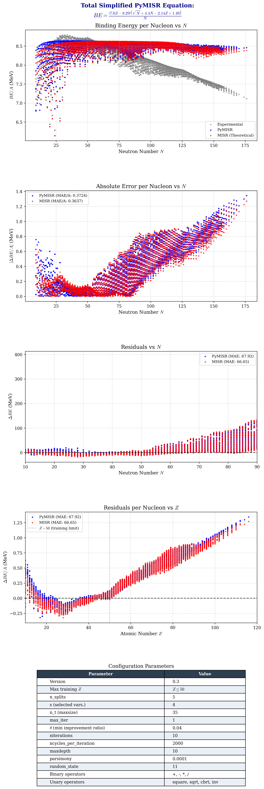

# PyMISR

**Iterative symbolic regression for nuclear binding energy discovery.**

This project re-implements the MISR (*Multi-objective Iterated Symbolic Regression*) algorithm from the paper [*"Discovering nuclear models from symbolic machine learning"*](https://www.nature.com/articles/s41567-023-02134-2) (Nature Physics, 2023). It uses [PySR](https://github.com/MilesCranmer/PySR) as the symbolic regression engine to automatically discover interpretable analytical expressions for nuclear binding energy from experimental data.

**Original repository:** [munozariasjm/nuclear-misr](https://github.com/munozariasjm/nuclear-misr)

---

## Result



*Comparison between experimental binding energy, the theoretical MISR model, and the PyMISR-discovered model across all known nuclei.*

---

## Equations

**MISR (from paper):**

$$
BE = \eta_0 \, Z \left(1 + \frac{1}{N} - \frac{a\,N}{Z^2}\right) \left[I\!\left(b - \frac{A^{1/3}\,N}{Z}\right) + c\right]
$$

with parameters: $a = 1.10$, $b = 32.43$, $c = 16.70$, $\eta_0 = 1.0$

**PyMISR (discovered, v0.3):**

$$
BE = \frac{(7.00\,Z - 8.29)\left(\sqrt{N} + 4.40\,N - 2.14\,Z + 1.49\right)}{N}
$$

---

## Project Structure

```
PyMISR/
├── datasets/
│   └── be_exp.csv              # Experimental binding energies (~4753 nuclei)
├── notebooks/
│   └── bindingEnergy.ipynb     # Interactive exploration notebook (v0.2)
├── results/
│   ├── MISRComparison.png              # Main comparison figure (4 panels)
│   ├── MISRComparison_BE_per_nucleon.png
│   ├── MISRComparison_absolute_error.png
│   ├── MISRComparison_residuals_N.png
│   ├── MISRComparison_residuals_Z.png
│   ├── MISRComparison_config.png       # Configuration parameters table
│   └── MISRComparison_results.csv      # Z, N, BE_exp, BE_misr, BE_pymisr
├── src/
│   └── bindingEnergy.py        # Main algorithm (v0.3, 511 lines)
└── README.md
```

---

## Requirements

**Python 3.10+**

```
pandas
numpy
scikit-learn
pysr
sympy
matplotlib
optuna       # (imported, pending integration)
```

**Julia 1.10+** (installed automatically by PySR via `juliacall`)

---

## Usage

```bash
cd PyMISR
python src/bindingEnergy.py
```

The script will:
1. Load and preprocess the experimental dataset
2. Filter nuclei to Z ≤ 50 for training
3. Run iterative symbolic regression with 5-fold cross-validation
4. Simplify the discovered equation with SymPy
5. Compare against the MISR1 model on all nuclei
6. Export plots and CSV results to `results/`

---

## Results

Performance on 2,443 unique nuclei (MAE in MeV):

| Region | MISR (theoretical) | PyMISR (v0.3) |
|---|---|---|
| Z ≤ 50 (training) | 5.75 | **5.32** |
| Z > 50 (extrapolation) | **104.71** | 107.35 |
| **Global** | **63.15** | 64.50 |

PyMISR outperforms MISR in the training region (Z ≤ 50) but shows lower extrapolation capability to heavier nuclei..

---

## References

1. Munoz, J. M., Udrescu, S. M., & Garcia Ruiz, R. F. (2023). *Discovering nuclear models from symbolic machine learning*. Nature Physics.
2. Munoz, J. M., Udrescu, S. M., & Garcia Ruiz, R. F. (2023). *Supplementary Information for: Discovering nuclear models from symbolic machine learning*. Nature Physics.
3. Pérez, J. & Vargas, K. (2026). PyMISR: Iterative Model Construction Algorithm using Symbolic Regression.
